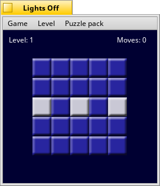
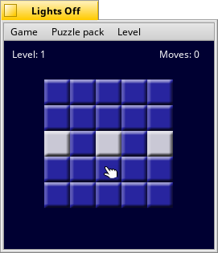

# Lights Off!

Lights Off! is a rendition of the original handheld game _Lights Out!_, manufactured by Tiger Electronics. If you haven't played it before, you may well find Lights Off! to be a very addictive puzzle game.

### How to Play

The objective is to turn all the lights off by pushing the fewest number of buttons. Easier said than done. :wink:

All 1050 puzzles from the original (_Classic_) game have been included, but arranged a bit differently. The puzzles have been grouped into puzzle packs under the _Puzzle Packs_ menu. The original game's main puzzles are in the _Classic_ pack. The rest are included from the manual for the original game and have been grouped by difficulty, with _Six Move Puzzles_ being the easiest and _Fifteen Move Puzzles_ being the hardest.

Beginners are advised to attempt the Classic pack before trying the others. Note that you may switch from one puzzle pack to another and not lose the progress you have made. You may also re-play any puzzle you have already solved by choosing it from the _Levels_ menu. The Classic pack features 50 puzzles, and the others host 100 each.

When you press a button, you turn it off or on, just like a light switch. Additionally, any button above, below, or beside the button you have pushed is also switched on or off.

### Winning

You must solve a puzzle within 10 moves of the minimum required. This means that you must solve every puzzle in the _Six Move Puzzles_ pack within 16 moves. For the Classic pack, the requirements are listed below:

Level | Moves Required | Level | Moves Required
:---: | :---: | :---: | :---:
Levels 1-5 | 6 | Levels 26-30 | 11
Levels 6-10 | 7 | Levels 31-35 | 12
Levels 11-15 | 8 | Levels 36-40 | 13
Levels 16-20 | 9 | Levels 41-45 | 14
Levels 21-25 | 10 | Levels 46-50 | 15

### How to Solve Classic Level 1

Solving the puzzle is as simple as pushing the two buttons below each lit button. Note that it does not matter what order you push them in. As you push them, note the different patterns that appear. Recognizing patterns of lights and the means to solve them is key to mastering Lights Off.

Now you should be on your way to turning off many, many lights. Good luck and enjoy!

* * *

_Lights Out!_ is a trademark of Tiger Electronics, Inc. _Lights Off!_ (C) 2005 DarkWyrm
